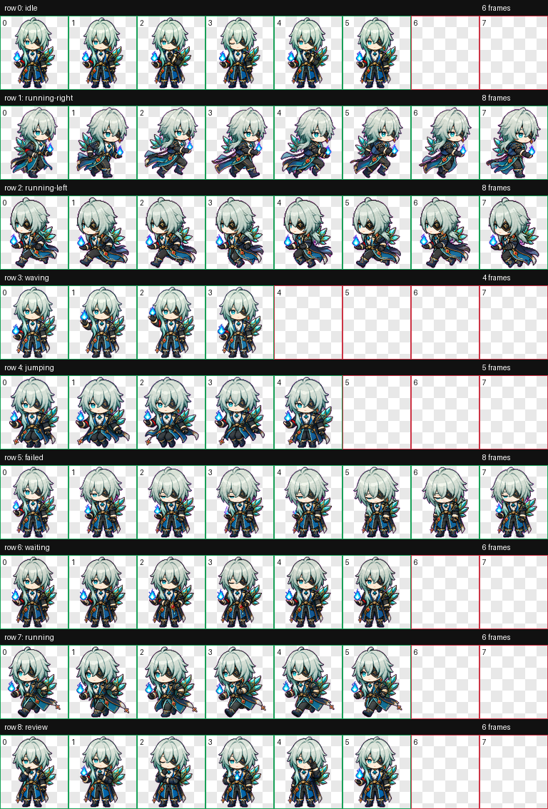
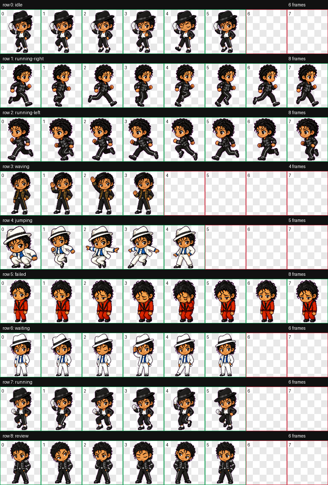

# Codex Pets

Fan-made animated pets for the Codex desktop app.

## Preview

### 那刻夏



| Idle | Waiting | Review | Run |
| --- | --- | --- | --- |
|  |  |  |  |

Full MP4 previews live in `previews/anaxa-sage/videos/`.

### MJ Legends



| Billie Jean | Bad | Smooth Criminal | Thriller |
| --- | --- | --- | --- |
|  |  |  |  |

Full MP4 previews live in `previews/mj-legends/videos/`.

## Pets

| Pet | Folder | Preview |
| --- | --- | --- |
| 那刻夏 | `pets/anaxa-sage` | [contact sheet](previews/anaxa-sage/contact-sheet.png) |
| MJ Legends | `pets/mj-legends` | [contact sheet](previews/mj-legends/contact-sheet.png) |

## Install

Install one pet:

```bash
cp -R pets/anaxa-sage ~/.codex/pets/
# or
cp -R pets/mj-legends ~/.codex/pets/
```

Install with the helper:

```bash
./scripts/install_pet.sh anaxa-sage
# or
./scripts/install_pet.sh mj-legends
```

Then open Codex, select the installed pet, and start a task to see the animations.

## Shinsekai Pet Host Prototype

This repo also includes a Phase 1 prototype for a Shinsekai-style desktop pet
host. It treats pets as extensible PetPacks and can route chat through pluggable
backends.

List discovered pets:

```bash
uv run python -m shinsekai_pet_host.cli list
```

Validate PetPacks:

```bash
uv run python -m shinsekai_pet_host.cli validate
```

Check Codex CLI auth:

```bash
uv run python -m shinsekai_pet_host.cli auth
```

Chat through Codex CLI:

```bash
uv run python -m shinsekai_pet_host.cli chat --pet anaxa-sage "帮我解释状态机"
```

Use an OpenAI-compatible API:

```bash
export PET_HOST_OPENAI_BASE_URL="https://api.openai.com"
export PET_HOST_OPENAI_API_KEY="..."
export PET_HOST_OPENAI_MODEL="gpt-5.4"
uv run python -m shinsekai_pet_host.cli chat --backend openai-compatible --pet mj-legends "Give me a short rehearsal note"
```

Optional PySide desktop host:

```bash
uv run --extra desktop python -m shinsekai_pet_host.cli desktop
```

## Repo Layout

```text
pets/
  <pet-id>/
    pet.json
    spritesheet.webp
    persona.md
    dialogue.yaml
previews/
  <pet-id>/
    contact-sheet.png
    gifs/
    videos/
catalog.json
scripts/
```

Each pet folder is self-contained and ready to copy into `~/.codex/pets/` or
load through the Shinsekai Pet Host prototype.

## Add A Pet

1. Create `pets/<pet-id>/pet.json` and `pets/<pet-id>/spritesheet.webp`.
2. Add `pets/<pet-id>/persona.md` and `pets/<pet-id>/dialogue.yaml`.
3. Add `previews/<pet-id>/contact-sheet.png`.
4. Add preview GIFs under `previews/<pet-id>/gifs/`.
5. Add preview videos under `previews/<pet-id>/videos/`.
6. Add the pet to `catalog.json`.
7. Run:

```bash
./scripts/validate_catalog.py
uv run python -m shinsekai_pet_host.cli validate
```

Keep assets GitHub-friendly. A finished Codex pet spritesheet is usually small enough for normal git storage.
